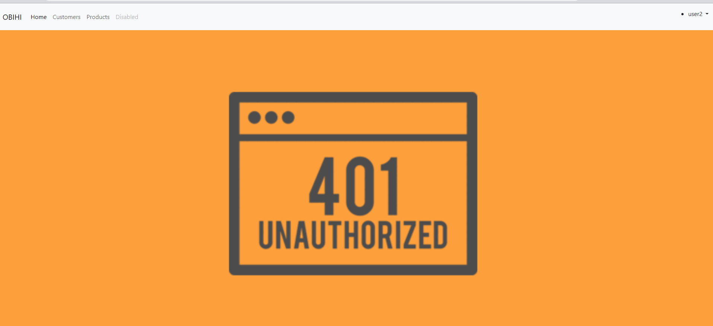
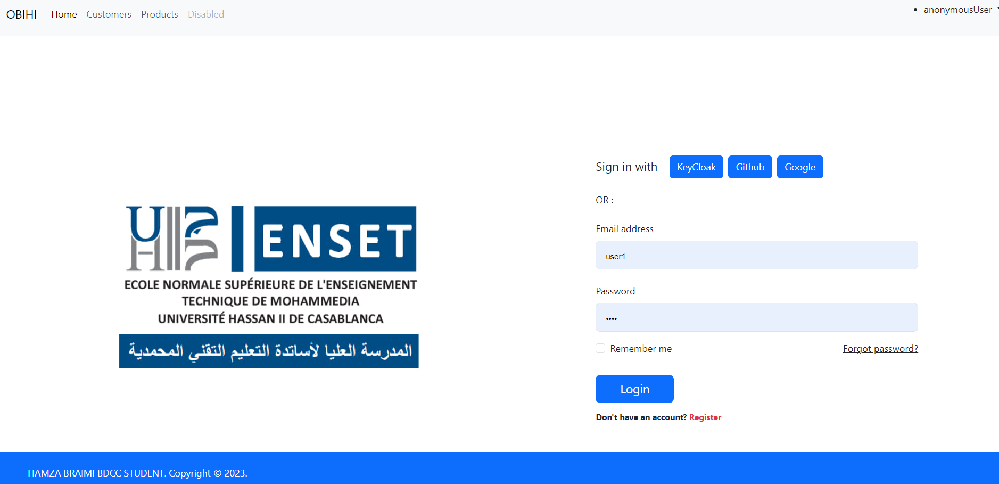

# Getting Started

### Reference Documentation

For further reference, please consider the following sections:

* [Official Apache Maven documentation](https://maven.apache.org/guides/index.html)
* [Spring Boot Maven Plugin Reference Guide](https://docs.spring.io/spring-boot/docs/3.2.0/maven-plugin/reference/html/)
* [Create an OCI image](https://docs.spring.io/spring-boot/docs/3.2.0/maven-plugin/reference/html/#build-image)
* [OAuth2 Client](https://docs.spring.io/spring-boot/docs/3.2.0/reference/htmlsingle/index.html#web.security.oauth2.client)
* [Spring Web](https://docs.spring.io/spring-boot/docs/3.2.0/reference/htmlsingle/index.html#web)
* [Spring Data JPA](https://docs.spring.io/spring-boot/docs/3.2.0/reference/htmlsingle/index.html#data.sql.jpa-and-spring-data)
* [Thymeleaf](https://docs.spring.io/spring-boot/docs/3.2.0/reference/htmlsingle/index.html#web.servlet.spring-mvc.template-engines)

### Guides

The following guides illustrate how to use some features concretely:

* [Building a RESTful Web Service](https://spring.io/guides/gs/rest-service/)
* [Serving Web Content with Spring MVC](https://spring.io/guides/gs/serving-web-content/)
* [Building REST services with Spring](https://spring.io/guides/tutorials/rest/)
* [Accessing Data with JPA](https://spring.io/guides/gs/accessing-data-jpa/)
* [Handling Form Submission](https://spring.io/guides/gs/handling-form-submission/)

### Google Authentication

* First of All  we will create our project in google console 

* Then we will ceate credentials

* Create client OAuth ID

*After Getting your id-Client * Secret Client you should add this conf in your application.properties  file

### Github  Authentication

* Register a new OAuth application

* By acceding to this path : Settings > Developer setting > Register a new OAuth application

* After Getting your id-Client * Secret Client you should add this conf in your application.properties  file

### KeyCloak Authentication

**Step 1 : Launch KeyCloak in your Local Machine {./kc.bat start-dev }**

**Step 2 : Create Realm**

**Step 3 :Create Client** 

 

**Step 4: Create Realm Roles**

**Step 5:  Create Users**

               add credentials for each user {In my case password = 1234}

                Second user user 2

**Step 6:  Assign Role for each user**
   
                For user 1

                For user 2

                Test KeyCloak Authentication
    POST http://localhost:8080/realms/Braimi-app/protocol/openid-connect/token
    Accept: application/json
    Content-Type:application/x-www-form-urlencoded
    
    grant_type=password&username=hamza-obihi&password=1234&client_id=app-client&client_secret={}

                Let's Display the content of our access_Token

**Step 7:Adding id-Client & Secret Client to application.properties**

                Then we get this result

# Implementation of Method Security

The problem that will face is in the getting token there is no roles -> we will fixe by checking Realm roles and Add to ID token 

# Add PreAuthorize

* And we will get something like that :

### How to assign Default roles during  registration phase ->{KeyCloak} <Realm Settings -> User  Registration -> Assign Roles >

### Add password Politics  {Authentication -> Policies -> Password Policy}

### Personalize Login page 

* First of we should add this config to SecurityFilterChain

      .oauth2Login(al->
      al.loginPage("/oauth2Login")
      .defaultSuccessUrl("/"))

* Result :

# Part 2 : Inventory MicroService

* Installing  Dependencies

* Config application.Properties

      spring.application.name=inventory-service
      server.port=8089
      spring.datasource.url=jdbc:h2:mem:products-db
      spring.h2.console.enabled=true
      
      spring.security.oauth2.resourceserver.jwt.issuer-uri=http://localhost:8080/realms/Braimi-app
      spring.security.oauth2.resourceserver.jwt.jwk-set-uri=http://localhost:8080/realms/Braimi-app/protocol/openid-connect/certs
      
  * Testing OurEnd Point

        POST http://localhost:8080/realms/Braimi-app/protocol/openid-connect/token
        Accept: application/json
        Content-Type: application/x-www-form-urlencoded
      
        grant_type=password&username=hamza-obihi&password=1234&client_id=app-client&client_secret=8hjsnTgTng57sIWYyO3nZWhQcVNP670G
      
      
        ###
        
        GET http://localhost:8089/products
        Authorization: Bearer {token}

# Angular Client-Side Rendering (CSR):

* Generate new Project

      ng new  Piko-front-angular-app --no-standalone

* Installing Bootstrap Dependencies

       npm install bootstrap bootstrap-icons

* Adding  Bootstrap Links

        "styles": [
        "src/styles.css",
        "node_modules/bootstrap/dist/css/bootstrap.min.css"
        ],
        "scripts": [
        "node_modules/bootstrap/dist/js/bootstrap.bundle.js"
        ]

* Import Bootstrap Library in Style.css file

      @import "bootstrap-icons/font/bootstrap-icons.min.css";
* Generate new Components 

      ng g c customers products

## PART 2: to Secure our Angular app we should create the second Client in the same realm

* Test our Client

      POST http://localhost:8080/realms/Braimi-app/protocol/openid-connect/token
      Accept: application/json
      Content-Type: application/x-www-form-urlencoded
      
      grant_type=password&username=hamza-obihi&password=1234&client_id=Angular-app-client

* Install KeyCloak Adapter
                                          
        npm i keycloak-angular keycloak-js
              

* Create Factory Function to initialize KeyCloak in app.module file

      function initializeKeycloak(keycloak: KeycloakService) {
            return () =>
            keycloak.init({
            config: {
            url: 'http://localhost:8080',
            realm: 'Braimi-app',
            clientId: 'Angular-app-client'
            },
            initOptions: {
            onLoad: 'check-sso',
            checkLoginIframe : true,
            silentCheckSsoRedirectUri:
            window.location.origin + '/assets/silent-check-sso.html'
            }
          });
      }

* Generate Guards Component

      ng g g guards/auth

add this config to Auth.Guard.tds

    import { Injectable } from '@angular/core';
    import {
    ActivatedRouteSnapshot,
    Router,
    RouterStateSnapshot
    } from '@angular/router';
    import { KeycloakAuthGuard, KeycloakService } from 'keycloak-angular';
    
    @Injectable({
    providedIn: 'root'
    })
    export class AuthGuard extends KeycloakAuthGuard {
    constructor(
    protected override readonly router: Router,
    protected readonly keycloak: KeycloakService
    ) {
    super(router, keycloak);
    }
    
    public async isAccessAllowed(
    route: ActivatedRouteSnapshot,
    state: RouterStateSnapshot
    ) {
    // Force the user to log in if currently unauthenticated.
    if (!this.authenticated) {
    await this.keycloak.login({
    redirectUri: window.location.origin
    });
    }
    
        // Get the roles required from the route.
        const requiredRoles = route.data['roles'];
    
        // Allow the user to proceed if no additional roles are required to access the route.
        if (!(requiredRoles instanceof Array) || requiredRoles.length === 0) {
          return true;
        }
        // Allow the user to proceed if all the required roles are present.
        return requiredRoles.every((role) => this.roles.includes(role));
    }
    }

* To Secure Products Component

    const routes: Routes = [
    {path:"customers" , component:CustomersComponent},
    
    {path:"products" , component:ProductsComponent,canActivate:[AuthGuard],data:{roles:['ADMIN']}}
    
    ];

* Generate Security Service Component

           ng g s services/security
 Add this configuration 
    
    import {Injectable} from "@angular/core";
    import {KeycloakProfile} from "keycloak-js";
    import {KeycloakEventType, KeycloakService} from "keycloak-angular";
    
    //@Injectable({providedIn : "root"})
    export class SecurityService {
    public profile? : KeycloakProfile;
    constructor (public kcService: KeycloakService) {
    this.init();
    }
    init(){
      console.log("Init ....")
      this.kcService.keycloakEvents$.subscribe({
      next: (e) => {
      console.log(e);
      if (e.type == KeycloakEventType.OnAuthSuccess) {
      console.log("OnAuthSuccess")
      this.kcService.loadUserProfile().then(profile=>{
      this.profile=profile;
      });
      }
      },
    error : err => {
        console.log(err);
        }  
        });
    }
    public hasRoleIn(roles:string[]):boolean{
        let userRoles = this.kcService.getUserRoles();
        for(let role of roles){
        if (userRoles.includes(role)) return true;
        } return false;
        }
    }