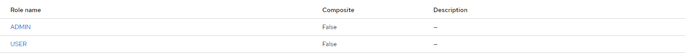
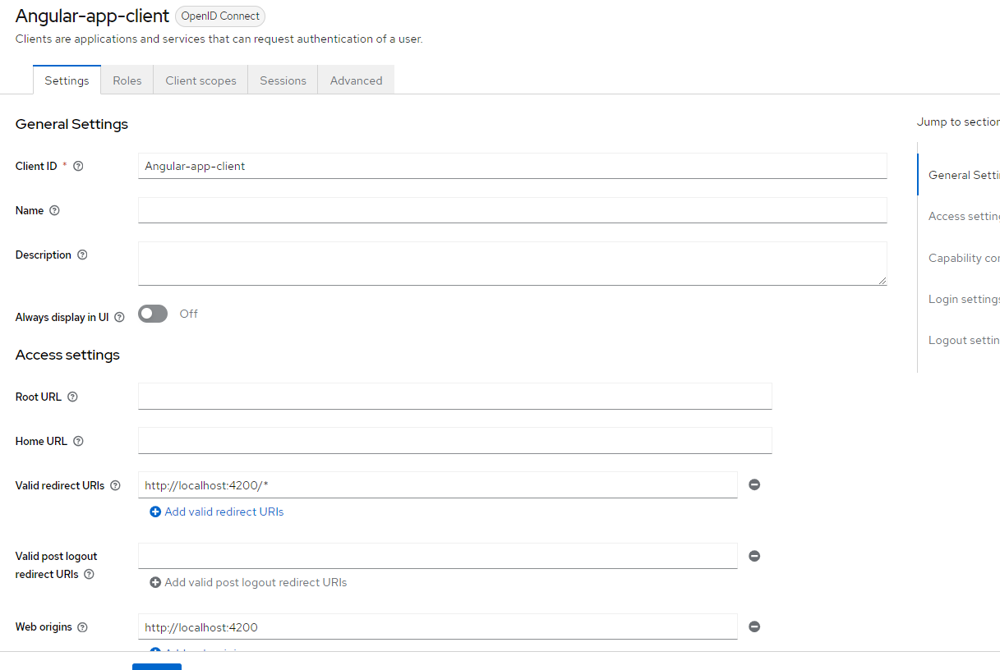
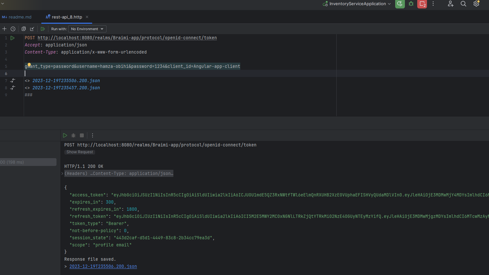

# Getting Started

### Reference Documentation

For further reference, please consider the following sections:

* [Official Apache Maven documentation](https://maven.apache.org/guides/index.html)
* [Spring Boot Maven Plugin Reference Guide](https://docs.spring.io/spring-boot/docs/3.2.0/maven-plugin/reference/html/)
* [Create an OCI image](https://docs.spring.io/spring-boot/docs/3.2.0/maven-plugin/reference/html/#build-image)
* [OAuth2 Client](https://docs.spring.io/spring-boot/docs/3.2.0/reference/htmlsingle/index.html#web.security.oauth2.client)
* [Spring Web](https://docs.spring.io/spring-boot/docs/3.2.0/reference/htmlsingle/index.html#web)
* [Spring Data JPA](https://docs.spring.io/spring-boot/docs/3.2.0/reference/htmlsingle/index.html#data.sql.jpa-and-spring-data)
* [Thymeleaf](https://docs.spring.io/spring-boot/docs/3.2.0/reference/htmlsingle/index.html#web.servlet.spring-mvc.template-engines)

### Guides

The following guides illustrate how to use some features concretely:

* [Building a RESTful Web Service](https://spring.io/guides/gs/rest-service/)
* [Serving Web Content with Spring MVC](https://spring.io/guides/gs/serving-web-content/)
* [Building REST services with Spring](https://spring.io/guides/tutorials/rest/)
* [Accessing Data with JPA](https://spring.io/guides/gs/accessing-data-jpa/)
* [Handling Form Submission](https://spring.io/guides/gs/handling-form-submission/)

### Google Authentication

* First of All  we will create our project in google console 

* Then we will ceate credentials

* Create client OAuth ID

*After Getting your id-Client * Secret Client you should add this conf in your application.properties  file

### Github  Authentication

* Register a new OAuth application

* By acceding to this path : Settings > Developer setting > Register a new OAuth application

* After Getting your id-Client * Secret Client you should add this conf in your application.properties  file

### KeyCloak Authentication

**Step 1 : Launch KeyCloak in your Local Machine {./kc.bat start-dev }**

**Step 2 : Create Realm**

**Step 3 :Create Client** 

 

**Step 4: Create Realm Roles**

**Step 5:  Create Users**

               add credentials for each user {In my case password = 1234}

                Second user user 2

**Step 6:  Assign Role for each user**
   
                For user 1

                For user 2

                Test KeyCloak Authentication
POST http://localhost:8080/realms/Braimi-app/protocol/openid-connect/token
Accept: application/json
Content-Type:application/x-www-form-urlencoded

grant_type=password&username=hamza-obihi&password=1234&client_id=app-client&client_secret={}

                Let's Display the content of our access_Token

**Step 7:Adding id-Client & Secret Client to application.properties**

                Then we get this result

# Implementation of Method Security

The problem that will face is in the getting token there is no roles -> we will fixe by checking Realm roles and Add to ID token 

# Add PreAuthorize

* And we will get something like that :

### How to assign Default roles during  registration phase ->{KeyCloak} <Realm Settings -> User  Registration -> Assign Roles >

### Add password Politics  {Authentication -> Policies -> Password Policy}

