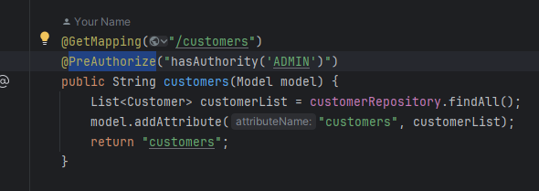
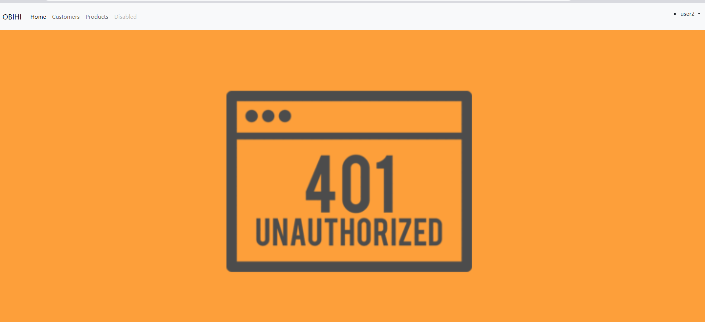
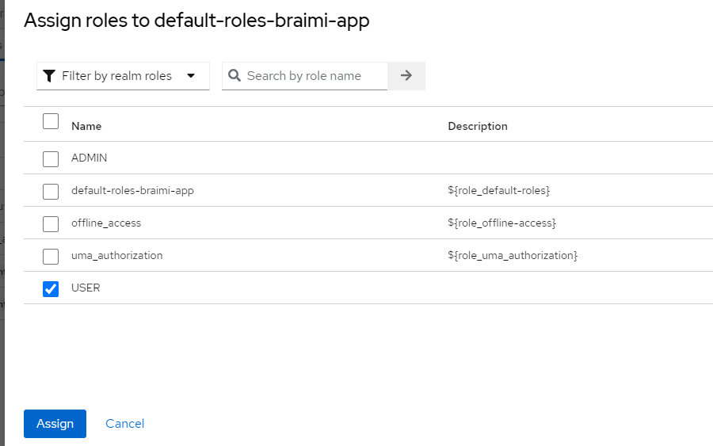
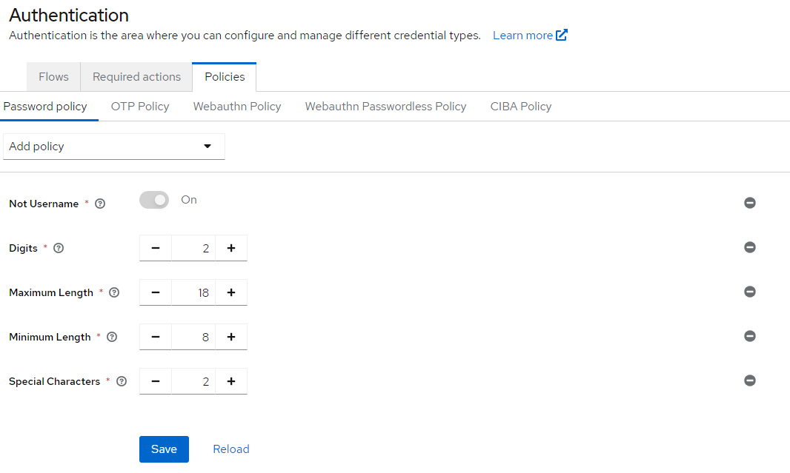
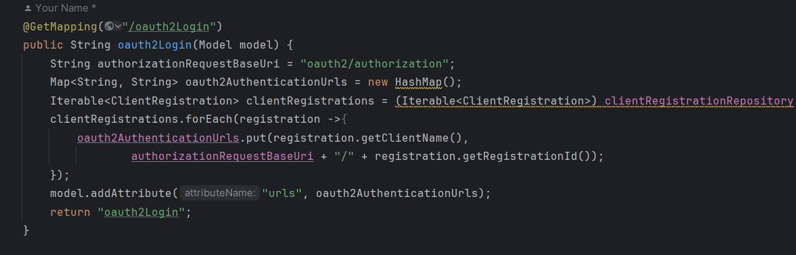
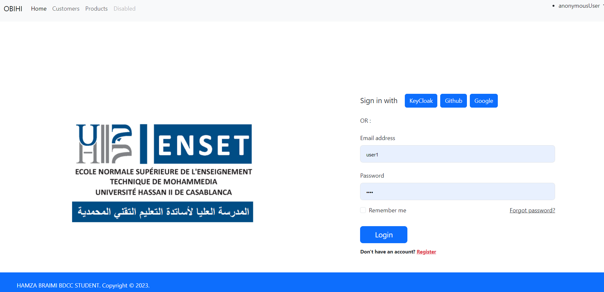
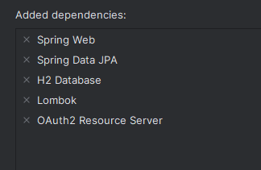

# Getting Started

### Reference Documentation

For further reference, please consider the following sections:

* [Official Apache Maven documentation](https://maven.apache.org/guides/index.html)
* [Spring Boot Maven Plugin Reference Guide](https://docs.spring.io/spring-boot/docs/3.2.0/maven-plugin/reference/html/)
* [Create an OCI image](https://docs.spring.io/spring-boot/docs/3.2.0/maven-plugin/reference/html/#build-image)
* [OAuth2 Client](https://docs.spring.io/spring-boot/docs/3.2.0/reference/htmlsingle/index.html#web.security.oauth2.client)
* [Spring Web](https://docs.spring.io/spring-boot/docs/3.2.0/reference/htmlsingle/index.html#web)
* [Spring Data JPA](https://docs.spring.io/spring-boot/docs/3.2.0/reference/htmlsingle/index.html#data.sql.jpa-and-spring-data)
* [Thymeleaf](https://docs.spring.io/spring-boot/docs/3.2.0/reference/htmlsingle/index.html#web.servlet.spring-mvc.template-engines)

### Guides

The following guides illustrate how to use some features concretely:

* [Building a RESTful Web Service](https://spring.io/guides/gs/rest-service/)
* [Serving Web Content with Spring MVC](https://spring.io/guides/gs/serving-web-content/)
* [Building REST services with Spring](https://spring.io/guides/tutorials/rest/)
* [Accessing Data with JPA](https://spring.io/guides/gs/accessing-data-jpa/)
* [Handling Form Submission](https://spring.io/guides/gs/handling-form-submission/)

### Google Authentication

* First of All  we will create our project in google console 

* Then we will ceate credentials

* Create client OAuth ID

*After Getting your id-Client * Secret Client you should add this conf in your application.properties  file

### Github  Authentication

* Register a new OAuth application

* By acceding to this path : Settings > Developer setting > Register a new OAuth application

* After Getting your id-Client * Secret Client you should add this conf in your application.properties  file

### KeyCloak Authentication

**Step 1 : Launch KeyCloak in your Local Machine {./kc.bat start-dev }**

**Step 2 : Create Realm**

**Step 3 :Create Client** 

 

**Step 4: Create Realm Roles**

**Step 5:  Create Users**

               add credentials for each user {In my case password = 1234}

                Second user user 2

**Step 6:  Assign Role for each user**
   
                For user 1

                For user 2

                Test KeyCloak Authentication
    POST http://localhost:8080/realms/Braimi-app/protocol/openid-connect/token
    Accept: application/json
    Content-Type:application/x-www-form-urlencoded
    
    grant_type=password&username=hamza-obihi&password=1234&client_id=app-client&client_secret={}

                Let's Display the content of our access_Token

**Step 7:Adding id-Client & Secret Client to application.properties**

                Then we get this result

# Implementation of Method Security

The problem that will face is in the getting token there is no roles -> we will fixe by checking Realm roles and Add to ID token 

# Add PreAuthorize

* And we will get something like that :

### How to assign Default roles during  registration phase ->{KeyCloak} <Realm Settings -> User  Registration -> Assign Roles >

### Add password Politics  {Authentication -> Policies -> Password Policy}

### Personalize Login page 

* First of we should add this config to SecurityFilterChain

      .oauth2Login(al->
      al.loginPage("/oauth2Login")
      .defaultSuccessUrl("/"))

* Result :

-----------------------------------------------------------------------------------------------------------

# Part 2 : Inventory MicroService

* Installing  Dependencies

* Config application.Properties

      spring.application.name=inventory-service
      server.port=8089
      spring.datasource.url=jdbc:h2:mem:products-db
      spring.h2.console.enabled=true
      
      spring.security.oauth2.resourceserver.jwt.issuer-uri=http://localhost:8080/realms/Braimi-app
      spring.security.oauth2.resourceserver.jwt.jwk-set-uri=http://localhost:8080/realms/Braimi-app/protocol/openid-connect/certs
      
  * Testing OurEnd Point

        POST http://localhost:8080/realms/Braimi-app/protocol/openid-connect/token
        Accept: application/json
        Content-Type: application/x-www-form-urlencoded
      
        grant_type=password&username=hamza-obihi&password=1234&client_id=app-client&client_secret=8hjsnTgTng57sIWYyO3nZWhQcVNP670G
      
      
        ###
        
        GET http://localhost:8089/products
        Authorization: Bearer {token}

# Angular Client-Side Rendering (CSR):

* Generate new Project

      ng new  Piko-front-angular-app --no-standalone

* Installing Bootstrap Dependencies

       npm install bootstrap bootstrap-icons

* Adding  Bootstrap Links

        "styles": [
        "src/styles.css",
        "node_modules/bootstrap/dist/css/bootstrap.min.css"
        ],
        "scripts": [
        "node_modules/bootstrap/dist/js/bootstrap.bundle.js"
        ]

* Import Bootstrap Library in Style.css file

      @import "bootstrap-icons/font/bootstrap-icons.min.css";
* Generate new Components 

      ng g c customers products

## PART 2: to Secure our Angular app we should create the second Client in the same realm

* Test our Client

      POST http://localhost:8080/realms/Braimi-app/protocol/openid-connect/token
      Accept: application/json
      Content-Type: application/x-www-form-urlencoded
      
      grant_type=password&username=hamza-obihi&password=1234&client_id=Angular-app-client

* Install KeyCloak Adapter
                                          
        npm i keycloak-angular keycloak-js
              

* Create Factory Function to initialize KeyCloak in app.module file

      function initializeKeycloak(keycloak: KeycloakService) {
            return () =>
            keycloak.init({
            config: {
            url: 'http://localhost:8080',
            realm: 'Braimi-app',
            clientId: 'Angular-app-client'
            },
            initOptions: {
            onLoad: 'check-sso',
            checkLoginIframe : true,
            silentCheckSsoRedirectUri:
            window.location.origin + '/assets/silent-check-sso.html'
            }
          });
      }

* Generate Guards Component

      ng g g guards/auth

add this config to Auth.Guard.tds

    import { Injectable } from '@angular/core';
    import {
    ActivatedRouteSnapshot,
    Router,
    RouterStateSnapshot
    } from '@angular/router';
    import { KeycloakAuthGuard, KeycloakService } from 'keycloak-angular';
    
    @Injectable({
    providedIn: 'root'
    })
    export class AuthGuard extends KeycloakAuthGuard {
    constructor(
    protected override readonly router: Router,
    protected readonly keycloak: KeycloakService
    ) {
    super(router, keycloak);
    }
    
    public async isAccessAllowed(
    route: ActivatedRouteSnapshot,
    state: RouterStateSnapshot
    ) {
    // Force the user to log in if currently unauthenticated.
    if (!this.authenticated) {
    await this.keycloak.login({
    redirectUri: window.location.origin
    });
    }
    
        // Get the roles required from the route.
        const requiredRoles = route.data['roles'];
    
        // Allow the user to proceed if no additional roles are required to access the route.
        if (!(requiredRoles instanceof Array) || requiredRoles.length === 0) {
          return true;
        }
        // Allow the user to proceed if all the required roles are present.
        return requiredRoles.every((role) => this.roles.includes(role));
    }
    }

* To Secure Products Component

    const routes: Routes = [
    {path:"customers" , component:CustomersComponent},
    
    {path:"products" , component:ProductsComponent,canActivate:[AuthGuard],data:{roles:['ADMIN']}}
    
    ];

* Generate Security Service Component

           ng g s services/security
 Add this configuration 
    
    import {Injectable} from "@angular/core";
    import {KeycloakProfile} from "keycloak-js";
    import {KeycloakEventType, KeycloakService} from "keycloak-angular";
    
    //@Injectable({providedIn : "root"})
    export class SecurityService {
    public profile? : KeycloakProfile;
    constructor (public kcService: KeycloakService) {
    this.init();
    }
    init(){
      console.log("Init ....")
      this.kcService.keycloakEvents$.subscribe({
      next: (e) => {
      console.log(e);
      if (e.type == KeycloakEventType.OnAuthSuccess) {
      console.log("OnAuthSuccess")
      this.kcService.loadUserProfile().then(profile=>{
      this.profile=profile;
      });
      }
      },
    error : err => {
        console.log(err);
        }  
        });
    }
    public hasRoleIn(roles:string[]):boolean{
        let userRoles = this.kcService.getUserRoles();
        for(let role of roles){
        if (userRoles.includes(role)) return true;
        } return false;
        }
    }

-----------------------------------------------------------------------------------------------------------
# Docker Part 

## Create Docker Compose file 

### Install mariadb + phpmyadmin with docker-compose

    services:
      mysql-db-inventory:
        image: mariadb:10.6
        container_name: mysql-db-inventory
        restart: always
        volumes:
          - mysql_data:/var/lib/mysql
        environment:
          MYSQL_DATABASE: inventory-db
          MYSQL_USER: root
          MYSQL_PASSWORD:
        ports:
          - 3306:3306
          healthcheck:
          test: [ "CMD", "mysqladmin" ,"ping", "-h", "localhost" ]
          timeout: 5s
          retries: 10
      phpmyadmin:
        image: phpmyadmin
        restart: always
        ports:
          - 9999:80
        environment:
          PMA_HOST: mysql-db-inventory
          PMA_PORT: 3306
          PMA_ARBITRARY: 1
    
    volumes:
      mysql_data:

* Run this Command Line :

        docker compose up

 

### Create Dockerfile in Inventory-Service

    FROM openjdk:21-oracle
    VOLUME /tmp
    COPY target/*.jar  app.jar
    ENTRYPOINT ["java","-jar", "app.jar"]

* Then :
 we will Extract our micro-service as jar by using that:

      mvn package

  * Create the image of this jar 

           docker build . -t inventory-service:v1

* After this we will add this config to docker-compose file

          enset-inventory-service:
            build: ./inventory-service
            container_name: enset-inventory-service
            ports:
            - '8089:8089'
            expose:
            - '8089'
            restart: always
            depends_on:
            - mysql-db-inventory
            environment:
              - DB_URL=jdbc:mysql://mysql-db-inventory:3306/inventory-db
              - JWT_ISSUER_URI=http://localhost:8080/realms/Braimi-app
              - JWT_JWK_SET_URI=http://keycloak:8080/realms/Braimi-app/protocol/openid-connect/certs

* We will run this command 

      docker compose up -d --build
      docker ps

### Create Dockerfile in Customer-Service

    FROM openjdk:21-oracle
    VOLUME /tmp
    COPY target/*.jar  app.jar
    ENTRYPOINT ["java","-jar", "app.jar"]

* Then :
  we will Extract our micro-service as jar by using that:

      mvn package

  * Create the image of this jar

           docker build . -t inventory-service:v1

    * Now in our Docker Compose we will Add {Keycloak + Postgres+MariaDb+PHPmyAdmin+Inventory Service}

          services:
          mysql-db-inventory:
          image: mariadb:10.6
          container_name: mysql-db-inventory
          restart: always
          volumes:
          - mysql_data:/var/lib/mysql
          environment:
          MYSQL_DATABASE: inventory-db
          MYSQL_USER: hamza
          MYSQL_PASSWORD: 1234
          MYSQL_ROOT_PASSWORD: admin
          ports:
            - 3306:3306
            healthcheck:
            test: [ "CMD", "mysqladmin" ,"ping", "-h", "localhost" ]
            timeout: 5s
            retries: 10
            phpmyadmin:
            image: phpmyadmin
            restart: always
            ports:
            - 9999:80
            environment:
            PMA_HOST: mysql-db-inventory
            PMA_PORT: 3306
            PMA_ARBITRARY: 1
      
          enset-inventory-service:
          build: ./inventory-service
          container_name: enset-inventory-service
          ports:
          - '8089:8089'
          expose:
            - '8089'
            restart: always
            depends_on:
            - mysql-db-inventory
            environment:
            - DB_URL=jdbc:mysql://mysql-db-inventory:3306/inventory-db
          #      - JWT_ISSUER_URI=http://localhost:8080/realms/Braimi-app
          #      - JWT_JWK_SET_URI=http://keycloak:8080/realms/Braimi-app/protocol/openid-connect/certs
      
          #  ############################   Postgres+KeyCloak  ##################################################################
          postgres-service:
          image: postgres
          container_name: postgres-service
          volumes:
          - postgres_data_enset:/var/lib/postgresql/data
          environment:
          POSTGRES_DB: keycloak_enset_db
          POSTGRES_USER: keycloak
          POSTGRES_PASSWORD: k1234
          ports:
            - '5432:5432'
            expose:
            - '5432'
            healthcheck:
            test: "exit 0"
            pgadmin4:
            image: dpage/pgadmin4
            container_name: pgadmin4
            restart: always
            ports:
            - "8888:80"
            environment:
            PGADMIN_DEFAULT_EMAIL: hamza@gmail.com
            PGADMIN_DEFAULT_PASSWORD: azer
            volumes:
            - pgadmin_data:/var/lib/pgadmin
            keycloak:
            image: quay.io/keycloak/keycloak:latest
            environment:
            KC_DB: postgres
            KC_DB_URL: jdbc:postgresql://postgres-service:5432/keycloak_enset_db
            KC_DB_USERNAME: keycloak
            KC_DB_PASSWORD: k1234
            KEYCLOAK_ADMIN: admin
            KC_HTTP_ENABLED: "true"
            KC_HOSTNAME_STRICT_HTTPS: "false"
            KEYCLOAK_ADMIN_PASSWORD: admin
            command:
            - start-dev
            restart: always
            ports:
            - '8080:8080'
            expose:
            - '8080'
            depends_on:
            - postgres-service
      
          volumes:
          mysql_data:
          postgres_data_enset:
          pgadmin_data:
      
* Keycloak---->   {username:admin,password :admin}
* Postgres---->   {username:hamza@gmail.com,password : azer}       

### Dockerize Angular part 

* run :

       ng build

  * create Docker file :  

          touch Dockerfile

  * add this config 
  
        # Stage 1: Compile and Build angular codebase
      
        # Use official node image as the base image
        FROM node:latest as build
      
        # Set the working directory
        WORKDIR /usr/local/app
      
        # Add the source code to app
        COPY .. /usr/local/app/
      
        # Install all the dependencies
        RUN npm install
      
        # Generate the build of the application
        RUN npm run build
        # Stage 2: Serve app with nginx server
        
        # Use official nginx image as the base image
        FROM nginx:latest
        
        # Copy the build output to replace the default nginx contents.
        COPY --from=build /usr/local/app/dist/piko-front-angular-app/browser /usr/share/nginx/html
        
        # Expose port 80
        EXPOSE 80
* Then will add this config in docker compose
    
           angular-front:
             build: ./piko-front-angular-app
             container_name: angular-front
             ports:
             - '8085:80'
               expose:
               - '8085'
                 restart: always