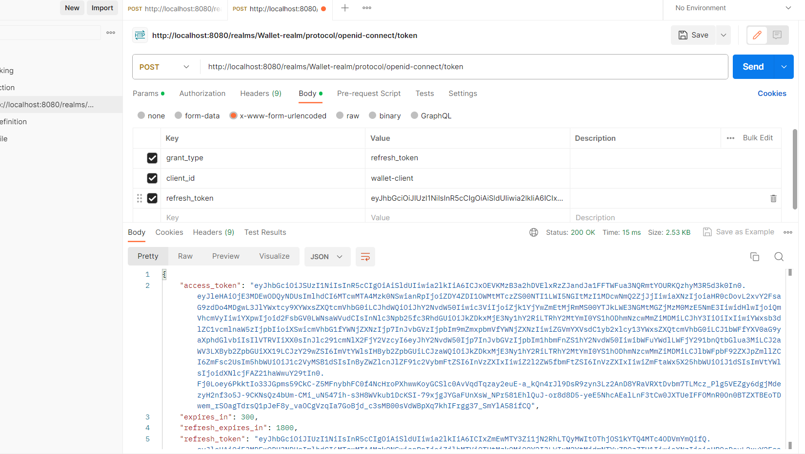

# Secure Spring Micro services and Angular Apps using Oauth2 OIDC  with Keycloak

## 📚Prerequisite

## ❕About This Repo

IIn this set of tasks, the goal is to set up and configure Keycloak, an open-source identity and access management solution. The process is detailed in several steps:

- Firstly, you need to download Keycloak version 19 from the official Keycloak website. Once downloaded, you can initiate Keycloak on your local machine or server.

- After launching Keycloak, the next step involves creating an administrative account. This account will be essential for managing and configuring Keycloak settings.

- Following the administrative setup, the creation of a realm is required. A realm in Keycloak serves as a security domain, facilitating the management of clients, users, and roles within a specific context.

* Partie 1 : 
            1. Télécharger Keycloak 19
            2. Démarrer Keycloak
            3. Créer un compte Admin
            4. Créer une Realm
            5. Créer un client à sécuriser
            6. Créer des utilisateurs
            7. Créer des rôles
            8. Affecter les rôles aux utilisateurs
            9. Avec PostMan :
    - Tester l'authentification avec le mot de passe
    - Analyser les contenus des deux JWT Access Token et Refresh Token
    - Tester l'authentification avec le Refresh Token
    - Tester l'authentification avec Client ID et Client Secret
    - Changer les paramètres des Tokens Access Token et Refresh Token
************************************************************************************************************************************************************************
  ## Discover KeyCloak Space

  # Create Realm
  
  # Create Users
  
  # Create Roles
  
  # Assign Roles to users
  

  
************************************************************************************************************************************************************************

## Test Phase With Postmane 

# Get token 

We can Display the content of this token by acceding to this :https://jwt.io/

# Recieve New token through sending refresh_token

- To do that we will copy the refresh token shown above and we will send a new query to the token service 
     

     